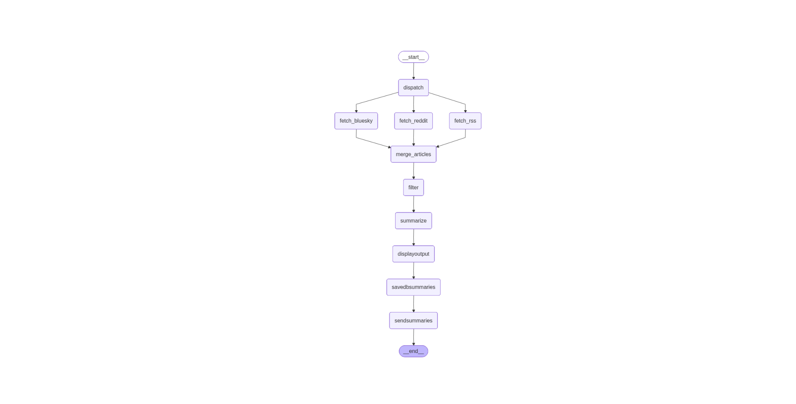

# Outil de veille techno

Objectif : développer un agent avec LangGraph qui effectue une veille technologique à l'aide de flux RSS, Reddit et Bluesky 


Process déroulé :

- Lit un OPML contenant les flux RSS / Atom ou des subs Reddit / comptes Bluesky
- Lit les flux RSS / Atom ou subs Reddit / flux Bluesky pour obtenir leur contenu
- Indexe le contenu obtenu à l'aide d'une base vectorielle
- Recherche dans le contenu de mots clés (vectorisés) prédéfinis 
- Les articles trouvés sur un seuil prédéfini remontent (scoring avec similartié cosinus)
- Résume les articles filtrés
- Envoi l'ensemble par mail

Une page web est également disponible pour lister l'historique des résumés.

# Techno Watch Tool

Objective: Develop an agent using LangGraph to perform tech watch using RSS feeds, Reddit channels and Blueky profils.

Process

- Reads an OPML file containing RSS/Atom feeds or a Json file pour Reddit / Bluesky
- Fetches and parses the sources feed content
- Indexes the content using a vector database
- Searches for predefined (vectorized) keywords in the content
- Retrieves articles that meet a predefined similarity threshold (cosine similarity scoring)
- Summarizes the filtered articles
- Sends the results by email

A web site is available to display the summaries history.

## Environnement

### uv

- init uv & création

```bash
$ uv venv
$ source .venv/Scripts/activate
$ uv sync --dev
```

- environnement déjà existant & cloné

```
$ source .venv/Scripts/activate # ou source .venv/scripts/activate
$ uv sync --dev
```

/!\ torch avec CUDA 118 est installé pour une utilisation du GPU pour les embeddings, voir selon la config. de la station de travail (Windows / Linux ou Mac) /!\

### Prérequis

- Ollama doit être lancé avant le cli, par défaut, il prend le modèle LLM_MODEL défini dans le `.env`


```bash
$ docker compose -f ollama.yml up -d
```

Le modèle est chargé au moment du lancement du _container_.

- Fichier OPML de flux RSS

Le fichier `my.opml` est conseillé, par défaut il prendra une liste en dur de 3 flux RSS

- Copier le .env.example sur .env puis le configurer : RSS, REDDIT, BLUESKY

les 3 clés suivantes permettent de désactiver les fetchers selon le service

RSS_FETCH=true
REDDIT_FETCH=true
BLUESKY_FETCH=true

```
# Configuration LLM et limite inférence
LLM_MODEL=mistral
MAX_TOKENS_GENERATE=200

# Configuration indexation et recherche
FILTER_KEYWORDS=ai agent,genai,artificial intelligence,python,django,cybersecurité,cve
THRESHOLD_SEMANTIC_SEARCH=0.3
LIMIT_ARTICLES_TO_RESUME=10

# Configuration fetch RSS
OPML_FILE=my.opml
MAX_DAYS=20

# Configuration SMTP pour l'envoi du mail de la veille techno
SMTP_SERVER=smtp.domain.ntld
SMTP_PORT=587
SMTP_LOGIN=login
SMTP_PASSWORD=your_password
SENDER=email_from@domain.ntld
SEND_EMAIL_TO=email_to@domain.ntld
```


## Cli

Se résume à un seul script à lancer

```bash
$ python -m app [--debug]
```

Ancienne version :

```bash
$ python main_agent.py
```

ou pour obtenir plus d'informations 

```bash
$ python main_agent.py --debug
```

## Tests

```bash 
$ pytest tests
$ pytest tests/test_sources_ponderation.py -v
$ pytest tests/test_send_articles_email.py -v
```

## Interface UI pour les articles résumés

```bash
$ uvicorn web:app --reload
```

Sur http://127.0.0.1:8000/

## L'automate exécuté 



## Gmail SMTP

Si Google gmail est utilisé pour envoyé le mail des résumé, un mot de passe application doit être créé 

Sinon le login / mot de passe de user@gmail.com provoquera une erreur du type

`smtplib.SMTPAuthenticationError: (534, b'5.7.9 Application-specific password required. For more information, go to\n5.7.9  https://support.google.com/mail/?p=InvalidSecondFactor ffacd0b85a97d-3e8c7375fb7sm2117460f8f.14 - gsmtp')`

> Page d'aide : https://support.google.com/accounts/answer/185833?visit_id=638933697167636567-786859144&p=InvalidSecondFactor&rd=1 

> Configurer un mot de passe application : https://myaccount.google.com/apppasswords 

Ce mot de passe application sera mis dans la variable `SMTP_PASSWORD` du .env

## Icônes

Pris en SVG sur https://fontawesome.com/search?q=reddit&o=r

## Conventions de nommage des branches

Les branches doivent suivre le format :
- `feat/` pour une nouvelle fonctionnalité.
- `fix/` pour une correction de bug.
- `docs/` pour de la documentation.
- `refactor/` pour du refactoring.
- `test/` pour des tests.
- `chore/` pour des tâches de maintenance.

Exemple : `feat/implement-source-weights`
