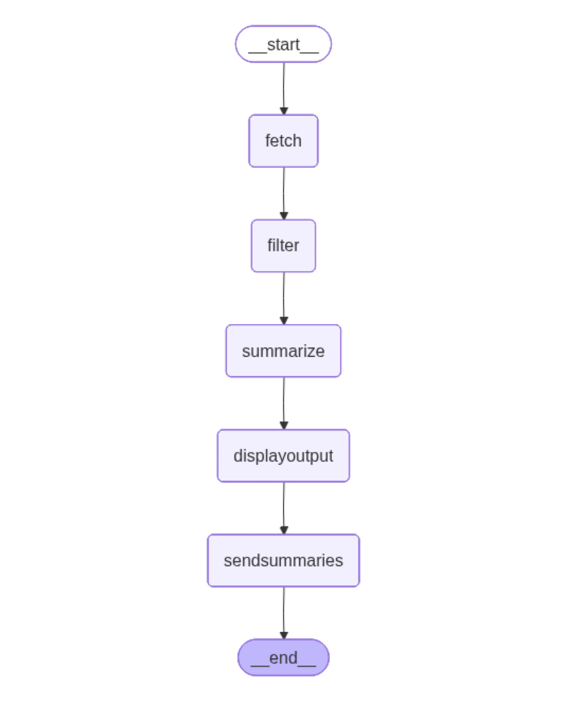

# Outil de veille techno

Objectif : développer un agent avec LangGraph qui effectue une veille technologique à l'aide de flux RSS

Process déroulé :

- Lit un OPML contenant les flux RSS / Atom
- Lit les flux RSS / Atom pour obtenir leur contenu
- Indexe le contenu obtenu à l'aide d'une base vectorielle
- Recherche dans le contenu de mots clés (vectorisés) prédéfinis 
- Les articles trouvés sur un seuil prédéfini remontent (scoring avec similartié cosinus)
- Résume les articles filtrés
- Envoi l'ensemble par mail

## Environnement

### uv

- init uv & création

```bash
$ uv venv
$ source .venv/Scripts/activate
$ uv sync --dev
```

- environnement déjà existant & cloné

```
$ source .venv/Scripts/activate # ou source .venv/scripts/activate
$ uv sync --dev
```

/!\ torch avec CUDA 118 est installé pour une utilisation du GPU pour les embeddings, voir selon la config. de la station de travail (Windows / Linux ou Mac) /!\

### Prérequis

- Ollama doit être lancé avant le cli, par défaut, il prend le modèle LLM_MODEL défini dans le `.env`


```bash
$ docker compose -f ollama.yml up -d
```

Le modèle est chargé au moment du lancement du _container_.

- Fichier OPML de flux RSS

Le fichier `my.opml` est conseillé, par défaut il prendra une liste en dur de 3 flux RSS

- Copier le .env.example sur .env puis le configurer 

```
# Configuration LLM et limite inférence
LLM_MODEL=mistral
MAX_TOKENS_GENERATE=200

# Configuration indexation et recherche
FILTER_KEYWORDS=ai agent,genai,artificial intelligence,python,django,cybersecurité,cve
THRESHOLD_SEMANTIC_SEARCH=0.3
LIMIT_ARTICLES_TO_RESUME=10

# Configuration fetch RSS
OPML_FILE=my.opml
MAX_DAYS=20

# Configuration SMTP pour l'envoi du mail de la veille techno
SMTP_SERVER=smtp.domain.ntld
SMTP_PORT=587
SMTP_LOGIN=login
SMTP_PASSWORD=your_password
SENDER=email_from@domain.ntld
SEND_EMAIL_TO=email_to@domain.ntld
```


## Cli

Se résume à un seul script à lancer

```bash
$ python main_agent_rss.py
```

ou pour obtenir plus d'informations 

```bash
$ python main_agent_rss.py --debug
```

## L'automate exécuté 

